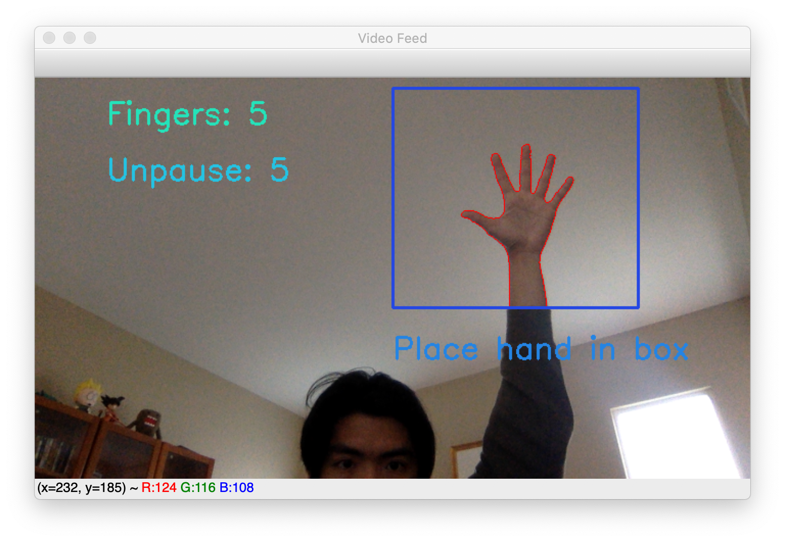

# README

### Abstract:
We are team TeleVision and we wanted to create a gesture control system where different hand positions can activate different commands on a computer. We created a Convolutional Neural Network to recognize how many fingers—from 0 to 5—a right hand holds up and maps the gestures to commands on a music playlist. This gesture recognition system allows for a different approach to controlling interfaces, increasing accessibility.

### Introduction:
We wanted to create a gesture control system where different hand positions can activate different commands on a computer. We wanted accurate recognition of input images so we tried to create a convolutional neural network for the task. We believe that introducing machine learning into the task would greatly benefit accuracy. Human hands are very complex because they can bend into various shapes and look different from different angles. This makes recognition difficult as different gestures may have similar contours. Nonetheless, we believe that remote control through hand gestures would offer offer an alternate approach to controlling interfaces, increasing accessibility for different groups of people. For those who may have disabilities or difficulties understanding or accessing traditional buttons, having an accurate, and easily learned hand-gesture control would improve accessibility.

### Method:
Rather than using a predefined classification algorithm (such as SIFT), we decided that using a CNN would help us create a more extensible program since we would be able to add more pictures to make the training data more robust. Although this process would take longer because of the extra training step, we figured that this would provide more accurate and consistent results in any type of environment. Our approach was to utilize a CNN to train on a black and white data set of hands to help us classify the amount of fingers a person holds up. As for our CNN, we used a simple three-block architecture that ultimately outputs one of the six hand classifications, which represents each finger count from zero fingers to five fingers.

Our approach was to utilize a CNN to train on a black and white data set of hands to help us classify the amount of fingers a person holds up. As for our CNN, we used a simple three-block architecture that ultimately outputs one of the six hand classifications, which represents each finger count from zero fingers to five fingers as shown below: 

- Block 1–Conv2D (128 outputs)
- Conv2D (128 outputs)
- MaxPool2D–Dropout

- Block 2–Conv2D (128 outputs)
- Conv2D (128 outputs)
- Conv2D (128 outputs)
- MaxPool2D–Dropout

- Block 3–Conv2D (128 outputs)
- Conv2D (128 outputs)
- Conv2D (256 outputs)
- MaxPool2D–Dropout

- Flatten
- Dense (64 outputs)
- Dense (6 outputs, one for each finger count)

As the architecture displays, each block performs a max pooling function after each convolution execution in order to prevent over-fitting in a neural network by providing a method for translation invariance to the internal representation. In other words, the input of the layer can be down sampled whilst maintaining the prominent portion. Consequently, the network's computational cost is reduced by decreasing the number of parameters to learn.

Similarly, each block ends with a dropout, which we intentionally implemented so that the CNN is not a fully connected neural network but rather a locally connected neural network. This is so that we can prevent the model from over-fitting when training and have the network efficiently classify hands in varying backgrounds. 

Figure 1 shows the architecture of our model after passing it into GCP to train.

After training on the data set, we developed our program so that each frame from the camera feed would be passed into the trained model. 

However, we wanted our program to be used in any environment. In order to do so, rather than directly inputting raw camera feed frames to our trained model, we had our program manipulate each frame so that they are filtered to match the training images' style: a grey-scaled, cropped out hand with a dark background. This post-editing allowed the trained model to more efficiently classify each hand gesture. 

Filtering process of each frame after the background or environment has been calibrated:
1.  Increase contrast and brightness
2.  Convert to grey scale
3.  Segment the hand region
4.  Replace background with black background
5.  Convert back to color (have three color channels)
6.  Resize to match trained images size (224×224 pixels)

Figure 2 shows the step-by-step process in which the rawfeed is manipulated to look like the training data images.

Figure 3 shows how we filter and adjust camera inputimages to match data

### Results:
We were able to create a decently functional music player with hand gesture controls. There are two modes to our program: training mode and testing mode. Within our main function, we have an if statement to separate the two modes our program can run in. If we do not pass in a .h5 file to the --weights args, the program will go into training mode to train a set of weights using our model. This mode should be run in GCP and could be linked to tensorboard to produce loss/accuracy graphs as well as image label predictions. If we do pass in weights as args, the program will go directly into testing mode and start up our musical playlist and camera system. The weights are loaded into our model and the camera input images will be adjusted and passed into the model for classification.

if ARGS.weights is None:
        model.summary()
        if not os.path.exists(checkpoint_path):
            os.makedirs(checkpoint_path)
        train(model, datasets, checkpoint_path, logs_path, init_epoch)
        evaluation = model.evaluate( x=datasets.test_data, verbose=1, batch_size = hp.batch_size)
        print(evaluation)
    else:
        # ask for the music file path
        music = input("Please input an audio file from the list below: \n- friends\n- hallelujah\n- flamingo\n- twistAndShout\n- world\n- dance\n")
        music += ".mp3"
        model.load_weights(ARGS.weights, by_name = False)
        test(model, music)
        
In training mode, we adjusted hyperparameters and batch sizes to get the model to lean how to classify images. We have 6 class labels (gestures of right hands holding up 0, 1, 2, 3, 4, or 5 fingers) the image could be classified to. After many rounds of training, we were able to achieve high accuracy and low loss. 

Figure 4 shows the accuracy and loss graphs as we trained our model.

Figure 5 shows the predictions for one of our trained models.

Our best set of weights is the file "your.weights.e007-acc0.9958.h5" and we achieved 99.58% accuracy and 1.647% loss in epoch 7. Figure 6 shows how accuracy and loss changes through each epoch.

In testing mode, we were able to create an interface with functioning gesture contols. Figure 8 shows the terminal output when the program is run, offering the user to select a song and performing background calibration.

Figure 9, 10, and 11 shows the program in action, with the different hand gestures successfully activating different controls for the music player. 

### Technical Discussion
The images we used to train were very clean and there was a clear contrast between the hand and the background. On one hand, this made the model very accurate with that specific set of data. Our accuracies were in the high 90s when we evaluated the model. On the other hand, this may have made the model biased because it was not able to recognize gestures as well when there was not as much contrast with the background.

We tried to fix this by increasing the contrast and brightness and making the camera feed black and white. This worked when the background was dark, but the trade off was that in a more well lit environment it was less effective. This raises the question of the importance of training data when creating a model in preventing bias and providing accurate results in various environments.

### Societal Discussion
This project is affected by various societal and historical factors.
- Privacy is becoming an issue as advancements in technology start infringing on individual rights. There may be privacy concerns since the camera must be on constantly for the model to detect the gestures. This could raise an issue if the program is ever hacked and the camera feed is used for a harmful purpose. For example, earlier this month a group of hackers, exposing vulnerabilities in jails, hospitals, and warehouses. Some of these cameras were used for facial-recognition technology, not dissimilar to the gesture-recognition involved in this project.
- Accessibility has also become more at the forefront of people's minds as technology improves, allowing more accommodations for those who need it. This affects our goal because our project allows for our media player to be controlled without any fine motor skills. This could be applicable for those with physical limitations.
- A new societal need that has arisen due to the COVID pandemic is contact-less technology. This project would make listening to music more sanitary because you would not have to actually touch anything, which could be helpful if listening to music with others.

The major stakeholders in this project are those who listen to music and use music players, specifically those who require accommodations to use certain technologies.This project could be applicable to anyone who enjoys listening to music. It provides a convenient way to play music while doing work or being busy since the user can change the music without actually opening the player simply by making a gesture to the camera. It would be less distracting than having to switch to the media player and change the song manually. The player might harm those who accidentally shuffle or play the incorrect song and hear unwanted music. The player is sensitive so a child might accidentally switch to a song with explicit words. It would also harm those who are concerned about privacy because the camera feed must be constantly turned on. This project would also make music players more accessible to those who have trouble with fine motor control or other inhibitions that prevent them from using the standard music player. Without actually having to press any buttons or touch the computer at all, people could change the song, pause it, replay it, or reshuffle the playlist.

Other journalism on this topic shows how businesses are redesigning their products and applications to adapt to the pandemic. Doors were installed that could be opened with the feet so that you would not have to touch the handle, contact-less delivery via various apps became prevalent, among other initiatives. This changes how our goal is framed. Not only is it helpful for those with disabilities, but also is useful to the general public in situations such as the COVID pandemic. However, this project can also be harmful to a person's privacy rights. The camera must be on for the application to work which may cause issues if a third party gets access to the camera feed. This would result in an invasion of an individual's privacy.

The data that we used contains bias because the images are all very clear and the contrast between the hand and the background is very high. They were also all of a light-skinned hand so the model is currently biased against more dark-skinned people. This very clearly represents historical biases since it was very easy to find a data set for more light-skinned hands. It is also part of the reason the model did not perform as well when we tested it. For a more robust training data set, data would have to be collected from a variety of people of different ethnicities for better performance.

### Conclusion
By training a CNN model with data, we were able to create a mini music player which is gesture controlled. Though accuracy and interface needs polishing, our program demonstrates how, with patience and perseverance, user interfaces could offer decent gesture controls. We believe that this project could be extended in different ways. There could be more gestures to recognize and more tools/controls to match these gesture to. Gestures could extend beyond hand gestures and into body stances or movements. These gesture/movement controls could benefit society by not only increasing accessibility and offering neat alternatives to the traditional controls.

### Documentation of program commands:
To start the program, set up the cs1430\_env and navigate to the television directory. You also want to make sure you have all the correct libraries installed before running the program. Run the command <python main.py --weights your.weights.e007-acc0.9958.h5>. You can also train your own data using GCP and use the --weights flag to change the weights being used. (ie. <python main.py --weights [your weight file name]>. Once the program loads, you can input what song you would like to play from the prompted list. Once a song is chosen, the camera will load and will wait 30 seconds to calibrate. [NOTE*** for best performance, be in a room with a blank background with a light source point towards you]. There are 4 hands you can use to manipulate the songs by placing your hand in the blue box. The program will read in three frames and choose the mood predicted finger count to execute a command. If the hand is left in the box past the 3rd frame, it will be read in the next cycle. Thus, to prevent the program form continuing to read in your hand gesture, put your hand down once the desire command is read in. The threshold popup demonstrates what image of you hand is being put into the program.

* 0 fingers: Pauses current song
* 1 finger: Shuffles the music to a random song
* 3 fingers: Restarts the current 
* 5 fingers: Resumes/plays current song

There are also two key commands. Because we are using a CNN, clicking on one of these commands may take up to a couple seconds before executing. Once on the the python video feed, you can click:
* c: Changes the song of your desire (input your song choice into the terminal)
     Would you like to change songs? (y/n) 
* q: Quits the program

 
 
